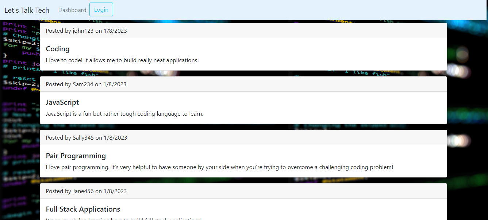
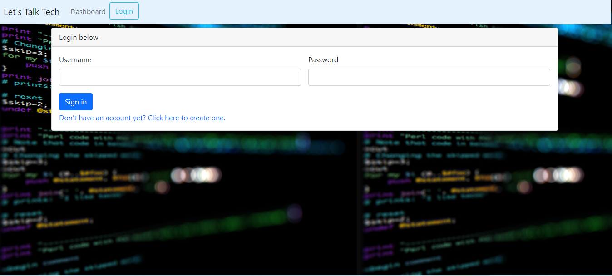

# All About Tech

[](https://opensource.org/licenses/MIT)

## **Description**
The purpose of this project was to create a full stack application. The website is a technology blog website that allows users to create and publish posts for all viewers of the website to see. A user may view other users's posts, however, in order leave a comment on another user's post or to view all of their current posts they must first be logged into their account. If they don't have an account yet, they may sign up to create one.

## **Deployed Application Link**

Click on the following link to be redirected to the deployed application: 

## **Technologies**

* 
* 
* 
* 
* 
* 
* 


## **Installation**
First, you'll want to clone down this repository onto your local machine. You can do this by copying the code within the green code button towards the upper-righthand side of the screen and typing out `git clone *insert your copied code here*` within your command terminal.

Next, you'll want to type the following in the command line. This installs the dependencies that will be used. 
```
npm install
```

Next, type the following into the command line to seed your database:
```
npm run seed
```

Lastly, you'll want to start the server. You can do this by typing the following within the command line at the root of this project directory.
```
npm start
```

## **Application**
Here's what the home page of the application looks like:



Here's what your page looks like if you were to click on one of the posts on the homepage while logged in:



## **License**
The following application is covered under the MIT License.